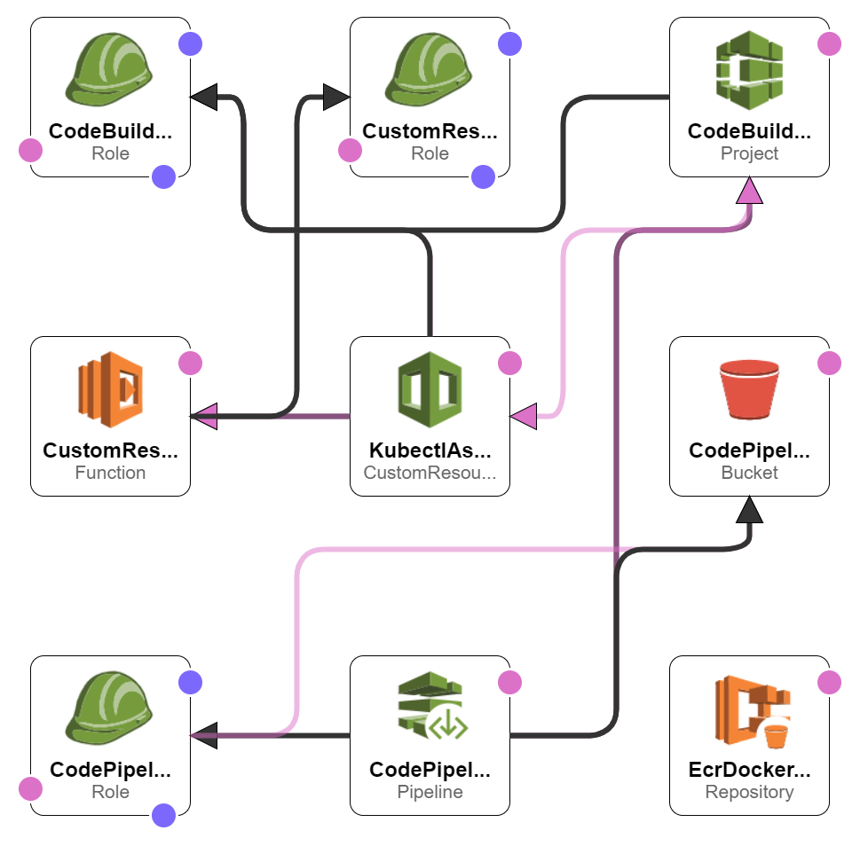

# flask-api-k8s

A simple Flask API is containerized using `Docker` and deployed to a Kubernetes cluster on AWS. CI/CD is set up with `CodePipeline`, and `CodeBuild`.

There are three endpoints:

- `GET '/'`: This is a simple health check, which returns the response 'Healthy'. 
- `POST '/auth'`: This takes a email and password as json arguments and returns a JWT based on a custom secret.
- `GET '/contents'`: This requires a valid JWT, and returns the un-encrpyted contents of that token. 

## Running Locally
Execute the following commands to install the python dependencies and bring up a local Flask server. The endpoint will be hosted at `localhost:8080`.
```bash
pip install -r requirements.txt
python main.py
```

To run the tests,
```bash
python -m pytest test_main.py
```
     
## Containerization
- [Dockerfile](Dockerfile) is used to containerize the app for production with [Gunicorn](https://gunicorn.org/) server.
- Build and test the container locally. In the root directory, replace the `<SOME_SECRET>` with anything and run the following commands in the terminal. The app relies on a secret `JWT_SECRET` to produce a JWT.
```bash
docker build -t "jwt-api-test" .
docker run --env JWT_SECRET=<SOME_SECRET> -p 80:8080 jwt-api-test
```

## CI/CD
A `CodePipeline` pipeline is set up to watch the `master` branch of this repo, via `AWS CloudFormation`. Template file: [ci-cd-codepipeline.cfn.yml](./ci-cd-codepipeline.cfn.yml). It will automatically run the tests, re-build the image and deploy to the EKS cluster, every time new changes are pushed to `master`. The secret is pulled from `AWS Parameter Store`.

<p align="center">
  
</p>
